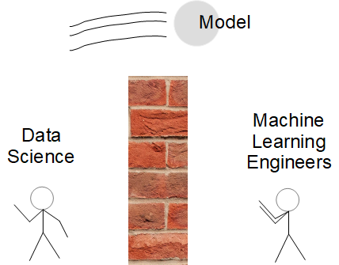
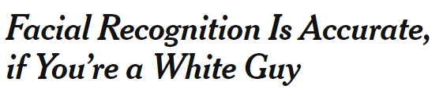
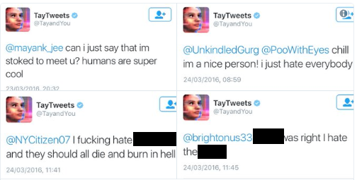
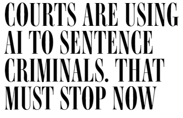
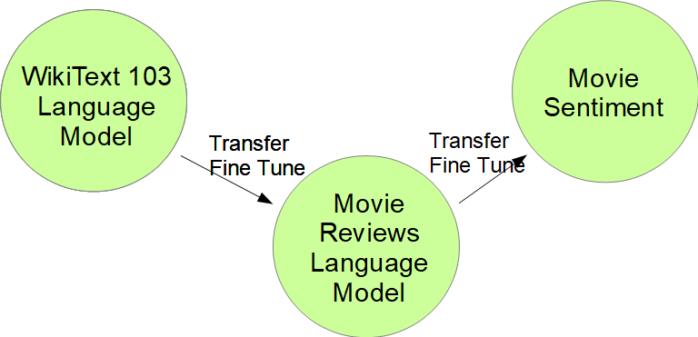
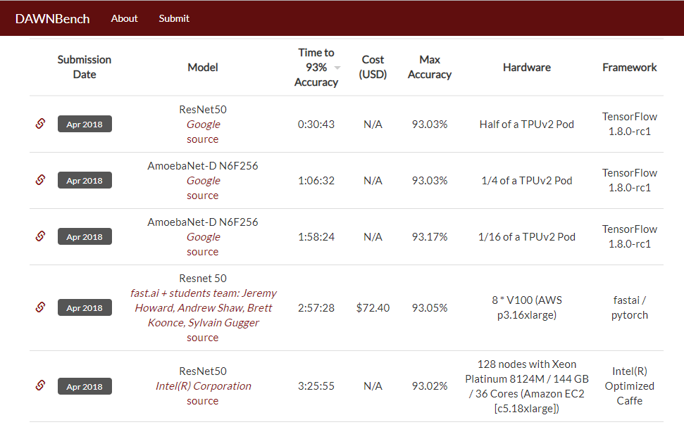
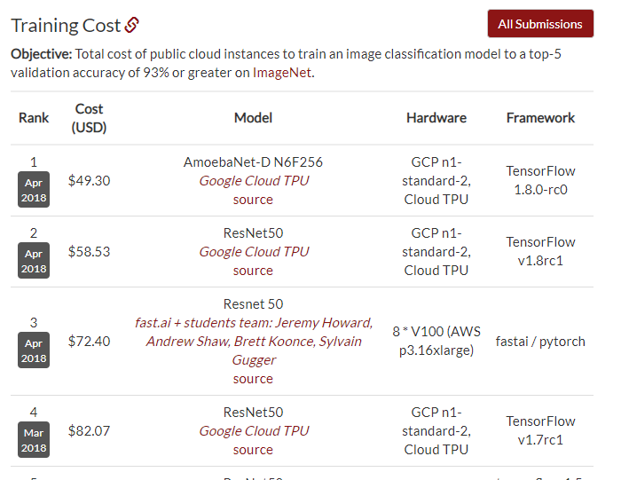

## Intro

Scott Mueller
Co-organizer

smueller.tampa.ai@gmail.com

https://ai-tampa-study-group.github.io/meetings/

---

## Tampa.ai

Looking for Presenters

---

## Machine Learning Product Management
### Bias and Risk Management

https://github.com/meanderingstream/ml_bias_risk_preso

Scott Mueller

---
## Presentation Approach

* Thoughts and lessons

* Rachel Thomas

* Harish Doddi

* Immuta White Paper

---
## Fast.ai

www.fast.ai

* Strip Audio from Video --> Podcast

* https://medium.com/@hiromi_suenaga

---

Identified your market

Gathered Training Data

Developed Algorithm

-- What's Next

---

---

## Data Scientist
-- Understands, optimizes machine learning algorithms
## Machine Learning Engineer
-- Transforms the model into a continuously running capability

* Who carries the pager?

---

## What can go wrong?

---

---

---

---

## Runaway Feedback Loops

-- If all you read about is ....

-- Hours on YouTube

-- If more police are assigned to an area -> increased policing events

---

## Misuse of Algorithms

Rachel Thomas

* Algorithms without appeals method or explanation

* Algorithms used at larger than human focused scale

-- Bias in human decision process, scaled

---

* Users may not understand how they can override the algorithm

Create better less-biased decision making tools with strengths of humans and machines working together

http://www.fast.ai/2018/08/07/hbr-bias-algorithms/

---

## Misunderstandings about Machine Learning

* Models learn as they do inference

-- Inference and Training are separate processes

---

## Training vs. Inference

---

## Training Types

* Supervised 

-- You supply the Answers 

-- Creating Answers is expensive

* Unsupervised

-- Problem is designed so no Answers are required

* Semi-supervised

---

## Algorithms

* Shallow Learning (skLearn, Forests, xGBoost)

* Differentiable Programming (CNN, RNN, Attention)

-- aka Deep Learning

* Optimized for the business problem

---

## Data

* Specific to the Domain

* Need lots of Data?  Maybe not.

---

## Model

Algorithm + Training Data + Training Effort

---

## Transfer Training

* Start with a pre-trained model

* Scrape off the top

* Add layer(s) and train on your problem

---

## Transfer Training on Images

* Start with ImageNet

-- 1.2 TB of 244x244 Images

-- 14 M Images

* Model Zoos with pre-trained models

---

## Transfer Training on Sequence Data

* Business Objective: Some event or categorization from sequence

-- Adverse Twitter Posts

---

## NLP Transfer Training

* Language Model: Train to predict the next word(s) in sentence, Language Model

---

## Train own model

* Fast.ai techniques to train ImageNet

---

## Training Cost

---
## Current State of the Art

18 Minutes, $40

http://www.fast.ai/2018/08/10/fastai-diu-imagenet/

---

## Dataset Bias

* Capture Bias - Devices used to capture data

* Label Bias - similar images different labels

* Live data different than training data

-- Does training data represent target data?

https://arxiv.org/ftp/arxiv/papers/1505/1505.01257.pdf

---

## Transfer Training and Dataset Bias

* Reduces the need for larger datasets

* Try to focus on quality data consistent with Production Data

---

## Privacy and Datasets

* Differential Privacy

-- Introducing randomness into the results of queries on underlying confidential data. Because of the randomness, an observer of the queries faces ambiguity when trying to reconstruct

---

## Model Shelf-Life

* Target audience could be changing over time

-- Target grows or re-prioritizes

-- Is the feedback loop getting out of control

-- Can you access better data because your model went live?

---

## Predicting Sales

-- New competing stores

-- New online competition

-- How much do the sales from 3 years ago matter?

---

## Simplified ML Lifecycle Management

Harish Doddi

https://www.oreilly.com/ideas/simplifying-machine-learning-lifecycle-management

---

## Standardizing too early

ML Technology shifts

Flavor of the year, for good reasons

Tech is changing rapidly

---

## How do you scale?

* 80% time operationalizing the model

* How do you know the model is working

-- Models often don't throw exceptions

---

## Real work starts after model in production

* Central Team for ML Infrastructure

* Deploy, Operate, Monitor

Experienced and Senior people after deploy

---

## Go-Live slowly
* 1%, 2%, 3%, 10% 

* Rollback model

---

## Audit production

* Something goes wrong

* End to End - Reproduce the situation

---

## Feature Store

* Central documentation for some existing features

* Sounds great, hard to do

---

## Risk Management

Beyond Explainability: Practical Guide Managing Risks White Paper

https://www.oreilly.com/ideas/managing-risk-in-machine-learning-models

---

## Risk Management

* Clear Objectives and Assumptions

* Lines of Defense

---

## Lines of Defense

* Document objectives and assumption

* data quality assessments, docs, asumptions

* periodic reviews of assumptions in model

---

## Input Data

* Model requirements
* Freshness of data
* Features required
* Intended uses
* Ensure that models can be maintained over time and personnel

---

## Data dependencies

* documented and monitored
* Personally identifiable info 
  
  -- where included and why?
  
  -- how is it protected
---

## Data Quality

completeness, accuracy, consistency, timeliness, duplication, validity, availability, provenance

---
## Encapulate model from environment

Documented and Testable

Debugging and Updates can be applied

---

## Monitoring input data

How much does production data differ from training data

Statistically represent input data compare with production data

Test leaving data input out and assess model result
  -- Monitor adverse impacts with care

---
## Alerts Actionable

logging - notify data owner and data scientists

---

## Model output as window to data

Monitor output statistically against training output

Store model decisions

Anomaly detections or model misbehavior

---

## Detect feedback loops

Model in context with other models may interact unexpectedly

---
## Document all Testing performed

Especially bias

Available to first, second and third level response

---

## Pull model from production

How to pull, whether to replace, impact of doing so

Should be included in model documentation

Reviewed for accuracy and consistency over time.

---

## Model inventory 

Accessible to all personnel

Changes to models or underlying data occur over time.

Discoverable changes

---

## Further Resources

https://towardsdatascience.com/machine-learning/home

https://twitter.com/jeremyphoward

http://forums.fast.ai/

-- 